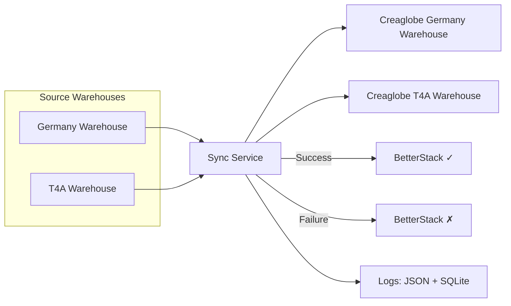

# 🚀 Patrik Metakocka Automation

Automation services for **Metakocka**, built to streamline warehouse operations and eliminate manual work.

---

## 📦 Warehouse Sync

[](https://uptime.betterstack.com/?utm_source=status_badge)

The **Warehouse Sync** service transfers stock levels from **source warehouses** (Time 4 Action, Germany) to the **Creaglobe Metakocka warehouse**, keeping the data up to date and accurate.

---

## ✨ Features

* 🔄 One-way sync (source → target warehouse)
* ⏰ Scheduled execution via cron (configurable)
* ▶️ Manual **Run Now** option (via API or web UI)
* 📂 Sync results archived as JSON files (local folder)
* ❤️ BetterStack heartbeats:

  * Success → **base URL**
  * Failure → **base URL + `/fail`**
* 🌐 Web dashboard for managing schedules and viewing logs

---

## ⚙️ How It Works



1. Fetch stock lists from **T4A** and **Germany Main**.
2. Transform data into **Creaglobe-compatible** format.
3. Push stock updates into **Creaglobe Metakocka**.
4. Report results to **BetterStack**:

   * ✅ Success → base URL
   * ❌ Failure → base URL + `/fail`
5. Store sync results in **JSON files + SQLite logs**.

---

## 🌐 Web Dashboard

The **scheduler dashboard** (`index.html` served from `/public`) lets you:

* Select **minutes, hours, and days** → generates a valid cron expression
* Enter API key to **update schedule**
* Run sync immediately with **Run Now**
* View the **last 10 runs** (timestamps + stock JSON links)

📸 Example:


---

## 🔑 API Endpoints

| Method | Endpoint                           | Description                   | Auth |
| ------ | ---------------------------------- | ----------------------------- | ---- |
| `GET`  | `/api/v1/uptime`                   | Health check                  | ❌    |
| `POST` | `/api/v1/warehouse/sync`           | Run sync immediately          | ✅    |
| `GET`  | `/api/v1/warehouse/sync/logs`      | Fetch latest sync logs        | ❌    |
| `PUT`  | `/api/v1/schedules/warehouse-sync` | Update sync cron expression   | ✅    |
| `GET`  | `/api/v1/schedules/warehouse-sync` | Fetch current cron expression | ❌    |

👉 Authentication uses header:

```
x-api-key: <your-api-key>
```

---

## 📂 Logs & Storage

* **JSON stock logs** → saved in `./tmp` (or path from `PUBLIC_DATA_FILE_PATH`)

  * Format: `{TIMESTAMP}_{SOURCE}.json`
  * Example: `20250903_141523001_T4A.json`

* **SQLite DB** → stored in `./db/patrik.db` (or `DB_FILE_PATH`)

  * Table: `warehouse_sync_log`
  * Fields: `id`, `link`, `sync_name`, `created_at`

---

## ⚡ Setup

1. **Clone the repository**

   ```bash
   git clone https://github.com/etiam-si/patrik-metakocka-automation
   cd patrik-metakocka-automation
   ```

2. **Install dependencies**

   ```bash
   npm install
   ```

3. **Configure `.env`**

   ```ini
   API_KEY=supersecretapikey

   # T4A warehouse (source)
   MK_SECRET_KEY_T4A=...
   MK_COMPANY_ID_T4A=...
   MK_T4A_WAREHOUSE_ID=...

   # Creaglobe warehouse (target)
   MK_SECRET_KEY_CREAGLOBE=...
   MK_COMPANY_ID_CREAGLOBE=...
   MK_CREAGLOBE_WAREHOUSE_ID_T4A=...
   MK_CREAGLOBE_WAREHOUSE_ID_GERMANY_ONE=...

   # BetterStack heartbeat
   BETTER_STACK_WH_SYNC_HEARTBEAT=https://uptime.betterstack.com/heartbeat/xxxxx
   # Success → base URL
   # Failure → base URL + /fail
   ```

4. **Run the service**

   ```bash
   node index.js
   ```

   Server starts at:
   👉 `http://localhost:3000`

---

## ⏱️ Cron Expression Examples

| Expression    | Meaning                           |
| ------------- | --------------------------------- |
| `* * * * *`   | Every minute                      |
| `*/5 * * * *` | Every 5 minutes                   |
| `0 * * * *`   | Every hour                        |
| `0 8 * * *`   | Every day at 08:00                |
| `0 8 * * 1-5` | Every weekday at 08:00            |
| `0 0 1 * *`   | First day of every month at 00:00 |

👉 Use the **web dashboard** to generate cron expressions easily.

---

## 📝 Notes

* ✅ Success heartbeat → **base URL**
* ❌ Failure heartbeat → **base URL + `/fail`**
* 📂 JSON logs and DB entries are always created
* 🌐 BetterStack provides real-time monitoring
* 🛠️ Project is under active development