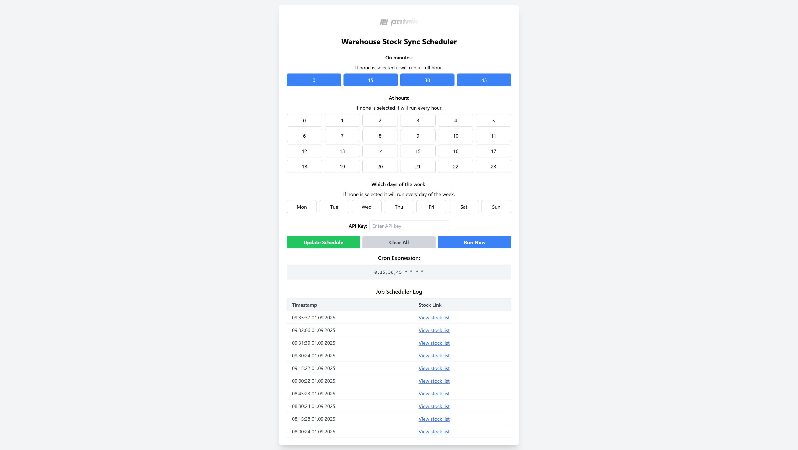

# Patrik Metakocka Automation

This repository contains automation services for **Metakocka**, designed to streamline operations and eliminate manual work.  

---

## 🚚 Warehouse Sync

[](https://uptime.betterstack.com/?utm_source=status_badge)

The **Warehouse Sync** service automatically transfers stock levels from one **source Metakocka warehouse** to a **target Metakocka warehouse**.  
It ensures that the target warehouse is always kept up to date with the source data.

### ✨ Features
- One-way sync (source → target).
- Triggered on a schedule (configurable with cron).
- Manual "Run Now" option via UI or API.
- Sync results stored in Google Drive (log + stock list link).
- **Heartbeat sent to BetterStack only after a successful sync** → detects downtime / failures.
- Web dashboard for managing schedules & viewing recent runs.

---

## ⚙️ How It Works

```mermaid
flowchart LR
    A[Source Warehouse] -->|fetch stock| B[Sync Service]
    B -->|push stock| C[Target Warehouse]
    B -->|heartbeat on success| D[BetterStack]
    B -->|log results| E[Google Drive]
````

1. Service fetches stock list from the **source warehouse**.
2. Data is transformed into the format required by the **target warehouse**.
3. Data is **pushed** to the target.
4. After success:

   * A **heartbeat** is sent to BetterStack.
   * Stock log is saved to Google Drive (for auditing).
5. If sync fails → no heartbeat is sent, BetterStack marks downtime.

---

## 🌐 Web UI

The `/public` folder includes a simple **scheduler dashboard**:

* Select minutes, hours, and days → generates a valid cron expression.
* Enter API key to **update schedule**.
* Run sync immediately via **Run Now** button.
* View the **last 10 runs** with timestamp + Google Drive stock log link.

Screenshot:

 <!-- optional -->

---

## 🔑 API Endpoints

| Method | Endpoint                           | Description                   | Auth |
| ------ | ---------------------------------- | ----------------------------- | ---- |
| `GET`  | `/api/v1/uptime`                   | Health check                  | ❌    |
| `POST` | `/api/v1/warehouse/sync`           | Run sync immediately          | ✅    |
| `PUT`  | `/api/v1/schedules/warehouse-sync` | Update sync cron expression   | ✅    |
| `GET`  | `/api/v1/schedules/warehouse-sync` | Fetch current cron expression | ❌    |

Authentication uses header:

```
x-api-key: <your-api-key>
```

---

## 📦 Setup

1. Clone the repo

   ```bash
   git clone https://github.com/youruser/patrik-metakocka-automation.git
   cd patrik-metakocka-automation
   ```

2. Install dependencies

   ```bash
   npm install
   ```

3. Configure `.env`

   ```ini
   API_KEY=supersecretapikey
   MK_SECRET_KEY_SOURCE=...
   MK_COMPANY_ID_SOURCE=...
   MK_SOURCE_WAREHOUSE_ID=...

   MK_SECRET_KEY_TARGET=...
   MK_COMPANY_ID_TARGET=...
   MK_T4A_WAREHOUSE_ID=...

   BETTER_STACK_WH_SYNC_HEARTBEAT=https://uptime.betterstack.com/heartbeat/xxxxx
   ```

4. Start the service

   ```bash
   node index.js
   ```

---

## 📝 Notes

* Only **successful syncs** send a BetterStack heartbeat.
* Failed syncs are automatically detected as downtime.
* Google Drive is used as a lightweight log archive.
* The project is under active development.
